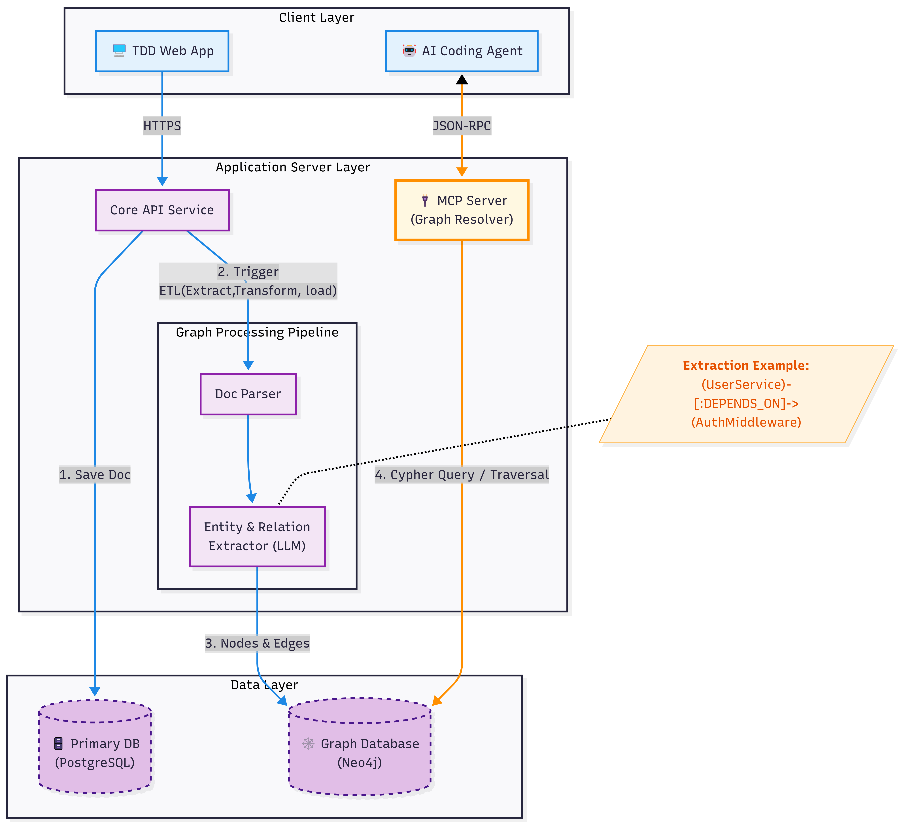
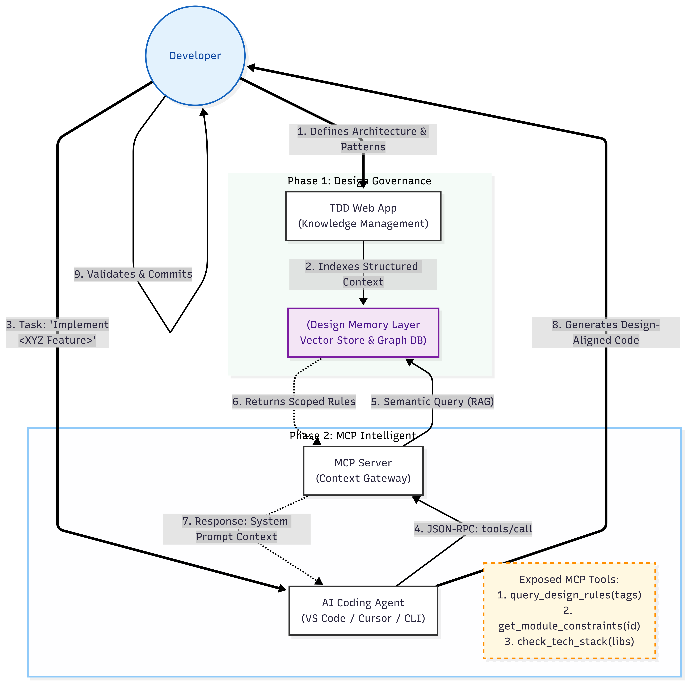
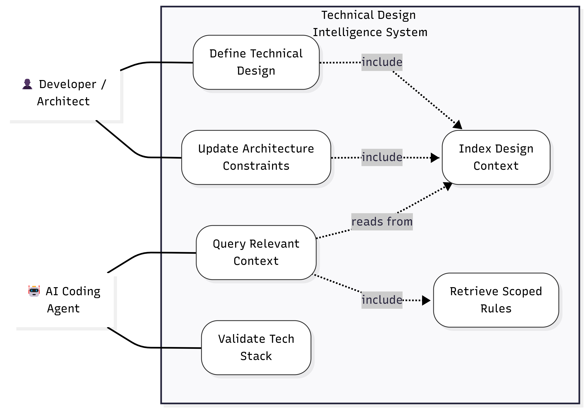

# Technical Design Document Intelligence System - Design

## System Architecture Overview

The Technical Design Document Intelligence System is built as a multi-layered architecture that transforms static design documents into an intelligent, queryable memory layer for AI coding assistants.

*Figure 1: Complete system architecture showing the three-layer design with client applications, application server components, and data layer*

## Architecture Layers

### 1. Client Layer
- **TDD Web App**: Web-based interface for developers to manage Technical Design Documents
- **AI Coding Agent**: VS Code extensions, Cursor, or CLI tools that consume design context
- **Communication**: HTTPS for web app, JSON-RPC for AI agent communication

### 2. Application Server Layer

#### Core API Service
Central orchestration service that handles:
- Document management and CRUD operations
- ETL pipeline triggering for document processing
- Integration with MCP Server for context queries

#### MCP Server (Graph Resolver)
Specialized Model Context Protocol server that:
- Exposes design context through standardized MCP interface
- Handles semantic queries from AI coding agents
- Returns scoped, relevant architectural context
- Implements graph traversal for relationship queries

#### Graph Processing Pipeline
Multi-stage processing system:

1. **Doc Parser**: Extracts structured content from Technical Design Documents
2. **Entity & Relation Extractor (LLM)**: Uses language models to identify:
   - Architectural entities (services, modules, components)
   - Relationships and dependencies
   - Design patterns and constraints
3. **Graph Construction**: Builds knowledge graph from extracted entities

### 3. Data Layer

#### Primary Database (PostgreSQL)
- Stores Technical Design Documents
- User management and access control
- Document versioning and metadata
- System configuration

#### Graph Database (Neo4j)
- Stores architectural knowledge graph
- Enables efficient traversal queries
- Supports semantic relationships between design elements
- Optimized for context retrieval patterns

## System Workflow

*Figure 3: End-to-end workflow showing the two-phase process from design governance to intelligent code generation*

### Phase 1: Design Governance
1. **Developer defines architecture & patterns** through TDD Web App
2. **System indexes structured context** into the Design Memory Layer
3. **Vector Store & Graph DB** store searchable design knowledge

### Phase 2: MCP Intelligence
4. **AI Coding Agent** makes JSON-RPC calls to MCP Server
5. **Semantic Query (RAG)** processes context requests
6. **System returns scoped rules** relevant to the query
7. **AI receives system-specific prompt context**
8. **Generates design-aligned code**
9. **Developer validates & commits** the generated code

## Key Components

### Technical Design Intelligence System
The core intelligence layer that:
- **Define Technical Design**: Allows architects to structure design knowledge
- **Update Architecture Constraints**: Maintains current design rules
- **Query Relevant Context**: Provides AI agents with scoped information
- **Validate Tech Stack**: Ensures generated code aligns with approved technologies
- **Index Design Context**: Creates searchable knowledge base
- **Retrieve Scoped Rules**: Returns only relevant architectural guidance

*Figure 2: Intelligence system workflow showing how developers and AI agents interact with the design memory layer*

### MCP Tools Exposed
The system exposes these tools through the Model Context Protocol:
1. `query_design_rules(tags)` - Get design rules by architectural tags
2. `get_module_constraints(id)` - Retrieve constraints for specific modules
3. `check_tech_stack(libs)` - Validate technology choices against approved stack

## Data Flow

### Document Processing Flow
1. **Save Doc** → Core API Service receives Technical Design Document
2. **Trigger ETL** → Initiates Extract, Transform, Load pipeline
3. **Nodes & Edges** → Graph processing creates knowledge graph structure
4. **Cypher Query/Traversal** → Enables efficient context retrieval

### Context Query Flow
1. **AI Agent Request** → JSON-RPC call to MCP Server
2. **Semantic Processing** → RAG-based query understanding
3. **Graph Traversal** → Neo4j queries for relevant context
4. **Scoped Response** → Returns only pertinent design information
5. **Code Generation** → AI uses context for architecture-aligned output

## Design Principles

### Query-Driven Architecture
- AI agents request specific context rather than receiving full dumps
- Responses are scoped to relevant architectural layers
- Maintains focus and reduces token usage

### Intelligent Memory Layer
- Technical Design Documents become active, queryable knowledge
- Graph-based relationships enable semantic context retrieval
- Vector embeddings support similarity-based queries

### Separation of Concerns
- Web app handles document management
- MCP server specializes in context delivery
- Graph processing pipeline ensures data quality
- Dual database approach optimizes for different access patterns

## Scalability Considerations

- **Horizontal scaling**: MCP servers can be load-balanced
- **Caching layer**: Frequently accessed design context cached
- **Async processing**: ETL pipeline runs asynchronously
- **Graph partitioning**: Large architectures can be segmented

## Security & Access Control

- **Authentication**: Secure access to design documents
- **Authorization**: Role-based access to different architectural layers
- **API security**: Rate limiting and validation on MCP endpoints
- **Data isolation**: Multi-tenant support for different projects/teams

## Architecture Diagrams Reference

### Figure 1: System Architecture
The complete three-layer architecture showing:
- **Client Layer**: TDD Web App and AI Coding Agents
- **Application Server Layer**: Core API Service, MCP Server, and Graph Processing Pipeline
- **Data Layer**: PostgreSQL for documents and Neo4j for graph relationships

### Figure 2: Technical Design Intelligence System
The intelligence workflow demonstrating:
- Developer/Architect interactions with the system
- AI Coding Agent query patterns
- Design memory layer operations
- Context retrieval and rule scoping

### Figure 3: Complete Workflow
The end-to-end process flow illustrating:
- Phase 1: Design governance and knowledge indexing
- Phase 2: MCP-driven intelligent context delivery
- Developer validation and code commitment cycle
- Exposed MCP tools and their functionality

## Implementation Notes

The architecture diagrams show several key implementation details:

1. **ETL Pipeline**: The Extract, Transform, Load process that converts documents into queryable graph structures
2. **Graph Traversal**: Cypher queries enable efficient relationship-based context retrieval
3. **MCP Tools**: Specific tools exposed (`query_design_rules`, `get_module_constraints`, `check_tech_stack`)
4. **Semantic Processing**: RAG-based query understanding for intelligent context matching
5. **Scoped Responses**: Context filtering ensures AI agents receive only relevant architectural guidance